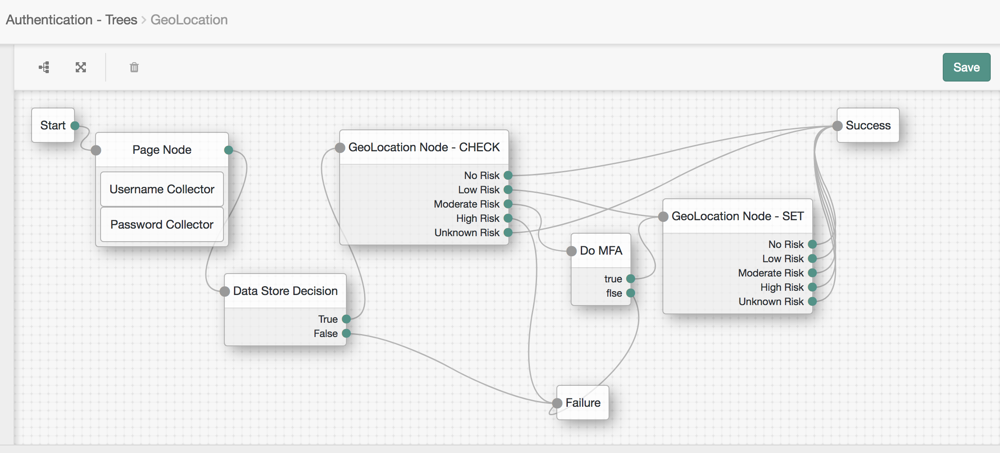

<!--
 * The contents of this file are subject to the terms of the Common Development and
 * Distribution License (the License). You may not use this file except in compliance with the
 * License.
 *
 * You can obtain a copy of the License at legal/CDDLv1.0.txt. See the License for the
 * specific language governing permission and limitations under the License.
 *
 * When distributing Covered Software, include this CDDL Header Notice in each file and include
 * the License file at legal/CDDLv1.0.txt. If applicable, add the following below the CDDL
 * Header, with the fields enclosed by brackets [] replaced by your own identifying
 * information: "Portions copyright [year] [name of copyright owner]".
 *
 * Copyright ${data.get('yyyy')} ForgeRock AS.
-->
# GeoLocation Node

**DESCRIPTION**

A utility authentication node for [Forgerock's Identity Platform](https://www.forgerock.com/platform/) 6.0 and above.

+ This node uses 3rd party services (IP-API or IPStack) to obtain longitude, latitude, and country information. 

+ At login, geolocation information is compared to last login.  Absolute distances, physical speed required to login in both locations, and country white/black lists are used to evaluate risk.

+ 5 egress points are used to identify risk levels: none, low, moderate, high, and unknown (used for service failures, unknown IP addressed, etc.)

+ This node may be used with risk aggregation nodes (riskIncreaseNode, riskAttributeCheckNode, riskIncreaseNode, and riskThresholdCheckNode).

**BUILD INSTRUCTIONS**
 
 Navigate to the source directory.  Run Maven to build:
 
     $ mvn clean install
 
 *Note: The code in this repository has binary dependencies that live in the ForgeRock maven repository. Maven can be configured to authenticate to this repository by following the following [ForgeRock Knowledge Base Article](https://backstage.forgerock.com/knowledge/kb/article/a74096897).*
 
 **INSTALLATION**
 
 + Copy the .jar file from the ../target directory into the ../web-container/webapps/openam/WEB-INF/lib directory where AM is deployed.
 
 + Restart the web container to pick up the new node.  The node will then appear in the authentication trees components palette.
 
 
 **USAGE**
 
 + Multiple instaces of the node can be inserted between any nodes in a tree to get the current values of context, header, session, cookies, callbacks, locales, and client IP.
 
 + Configuration - Parameters
     + **Node Mode** - Check or Set.
        + Check - Node will evaluate risk.
        + Set - Node will set the data store field to the current IP + timestamp
     + **IP Data Store Field** - The user attribute that will be used to store IP information.  This field must be mapped to a data store field.  *(Add to field list in UI:  Data Store --> User Configuration --> LDAP User Attributes)*
     + **IP Location Provider Service** - Currently, IP-API and IP Stack are supported.
     + **GeoLocation Service Access Key** - The service key required by service provider. *(Note: For providers that do not require keys, such as IP-API, enter any value.  This value will not be used in this case, but due to the way passwords are handled in the UI, this field cannot be left blank.)*
     + **Proxy Mode** - DIRECT or PROXY.  Direct mode is used for direct connections to AM.  Proxy mode will read the client IP as presented by the proxy identified in the proxy header field.
     + **Proxy Header** - The header that has been configured to present the client IP address (typically, x-forwarded-for).
     + **Distance Unit** - Mile or KM
     + **Check Distance** - Considers distance from initial login if enabled.
         + **Max Distance for NO Risk** - no risk range will be from 0 to this value (miles or KM).
         + **Max Distance for LOW Risk** - low risk range will be from no risk max to this value (miles or KM).
         + **Max Distance for MODERATE Risk** - moderate risk range will be from low risk max to this value (miles or KM).  High risk is anything above this value.
     + **Check Speed** - Considers the speed that the user would have to travel in order to have logged in last time and now.
         + **Max Speed for NO Risk** - no risk range will be from 0 to this value (miles or KM).
         + **Max Speed for LOW Risk** - low risk range will be from no risk max to this value (miles or KM).
         + **Max Speed for MODERATE Risk** - moderate risk range will be from low risk max to this value (miles or KM).  High risk is anything above this value.
     + **Valid Country List Type** - None, White, or Black
         + **White List** - List of 2-letter coutry codes.  If list type is white and country **is not** on this list, the authentication will result in HIGH risk.
         + **Black List** - List of 2-letter coutry codes.  If list type is black and country **is** on this list, the authentication will result in HIGH risk. 
         
 + Configuration - Notes
     + The node can be configured in 2 modes: set and check
        + If **CHECK**, the rules will be evaluated.  The highest risk evaluated for distance, speed, white/black list, etc., will be returned.
        + If **SET**, the IP Data Store Field will be replaced with the current IP + timestamp.  This is to allow a reset of the the user location, typically after an additional authentication check.  In this mode, all exit points should be configured to connect to the same location (success node id shown in diagram).

**SCREENSHOTS**

+ This diagram shows a typical use case:
    + After username/password validation, a geolocation check is done in CHECK mode.
    + Based on the result, and additional authentication may be initiated.
    + Once the additional authentication completes successfully, the geolocation node is fire in SET mode in order to reset the location for subsequent logins.  
        
**TERMS OF USE**

*The sample code described herein is provided on an "as is" basis, without warranty of any kind, to the fullest extent permitted by law. ForgeRock does not warrant or guarantee the individual success developers may have in implementing the sample code on their development platforms or in production configurations.*

*ForgeRock does not warrant, guarantee or make any representations regarding the use, results of use, accuracy, timeliness or completeness of any data or information relating to the sample code. ForgeRock disclaims all warranties, expressed or implied, and in particular, disclaims all warranties of merchantability, and warranties related to the code, or any service or software related thereto.*

*ForgeRock shall not be liable for any direct, indirect or consequential damages or costs of any type arising out of any action taken by you or others related to the sample code.*
